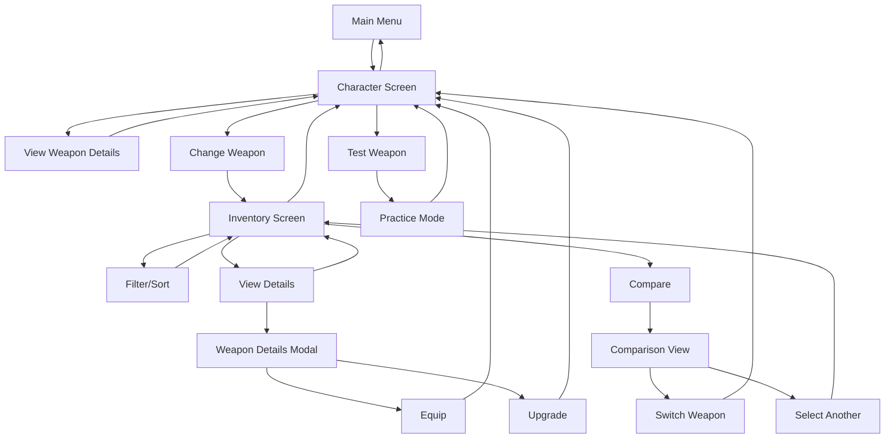

# Character & Weapon Screen Design Improvements
## Ninja Slicer Game - Design Specification

**Document Version:** 1.0  
**Date:** 2025-12-27  
**Game:** Ninja Slicer (Phaser 3)  
**Theme:** Supernatural/Horror

---

## Table of Contents

1. [Executive Summary](#executive-summary)
2. [Current State Analysis](#current-state-analysis)
3. [Character Screen Improvements](#character-screen-improvements)
4. [Weapon Screen Improvements](#weapon-screen-improvements)
5. [Visual Design System](#visual-design-system)
6. [User Flow Improvements](#user-flow-improvements)
7. [Implementation Considerations](#implementation-considerations)
8. [Asset Requirements](#asset-requirements)

---

## Executive Summary

This document outlines comprehensive design improvements for the Character and Weapon selection screens in the Ninja Slicer game. The current implementation provides basic functionality but lacks visual polish, user experience refinement, and thematic consistency with the supernatural/horror aesthetic.

**Key Improvements:**
- Enhanced visual hierarchy and information architecture
- Interactive weapon preview with animations
- Comparative stat displays
- Thematic UI elements matching the horror aesthetic
- Improved mobile responsiveness
- Better accessibility and clarity

---

## Current State Analysis

### Character Scene (src/scenes/CharacterScene.ts)

**Current Implementation:**
- Simple centered layout with weapon icon, name, and tier
- Two-column stat display (Weapon Stats left, Player Stats right)
- Basic navigation buttons (Change Weapon, Back)
- Minimal animations (fade-in effects)
- Plain background rectangle

**Strengths:**
- Clean, straightforward layout
- Functional information display
- Basic animation system in place

**Weaknesses:**
- Lacks visual interest and thematic elements
- No weapon preview or demonstration
- Limited interactivity
- No comparison between weapons
- Static presentation
- No visual feedback for upgrades
- Missing rarity indicators
- No weapon effectiveness visualization

### Inventory Scene (src/scenes/InventoryScene.ts)

**Current Implementation:**
- 3x2 grid of weapon cards
- Cards show: icon, name, tier, description
- Locked/unlocked states with lock icon
- Selection indicator for equipped weapon
- Basic hover effects (scale up)
- Simple feedback messages

**Strengths:**
- Grid layout is functional
- Card component is reusable
- Clear visual states (locked/unlocked/selected)

**Weaknesses:**
- No weapon preview or comparison
- Limited information per card
- No sorting or filtering options
- No visual indication of weapon effectiveness
- Missing rarity colors
- No upgrade path visualization
- Cards don't show next tier benefits
- No weapon type categorization

### Shop Scene (src/scenes/ShopScene.ts)

**Current Implementation:**
- Tabbed interface (Weapons/Upgrades)
- Vertical list of purchasable items
- Souls currency display
- Confirmation dialogs
- Progress bars for upgrade tiers

**Strengths:**
- Good tab system
- Clear pricing information
- Confirmation prevents accidental purchases

**Weaknesses:**
- No weapon preview in shop
- Limited visual differentiation between tiers
- No comparison between weapons
- Missing rarity indicators
- No visual representation of weapon effects

---

## Character Screen Improvements

### 1. Visual Layout Redesign

#### Proposed Layout Structure

```
┌─────────────────────────────────────────────────────────────┐
│  [BACK]                    CHARACTER                    [?]  │
├─────────────────────────────────────────────────────────────┤
│                                                             │
│  ┌─────────────────────────────────────────────────────┐   │
│  │                                                     │   │
│  │              WEAPON PREVIEW AREA                    │   │
│  │           (Animated weapon display)                  │   │
│  │                                                     │   │
│  │              [Large Weapon Icon]                    │   │
│  │           (Idle animation + glow)                    │   │
│  │                                                     │   │
│  │         Weapon Name (Rarity Colored)                 │   │
│  │         Tier Badge (I, II, III)                      │   │
│  │         Effectiveness Icons                          │   │
│  │                                                     │   │
│  └─────────────────────────────────────────────────────┘   │
│                                                             │
│  ┌──────────────────────┐  ┌──────────────────────┐       │
│  │   WEAPON STATS      │  │   PLAYER STATS       │       │
│  │                      │  │                      │       │
│  │  • Damage: 100      │  │  • Slash Width: 1.2x │       │
│  │  • Speed: Fast      │  │  • Lives: 3          │       │
│  │  • Range: Medium    │  │  • Score Mult: 1.5x  │       │
│  │  • Effects: 2       │  │  • Crit Chance: 15%  │       │
│  │                      │  │                      │       │
│  │  [View Details]      │  │  [View Upgrades]     │       │
│  └──────────────────────┘  └──────────────────────┘       │
│                                                             │
│  ┌─────────────────────────────────────────────────────┐   │
│  │  EFFECTIVENESS AGAINST ENEMIES                       │   │
│  │  [Visual bar chart or radar chart]                   │   │
│  │  Zombie: ████████░░ 80%  Vampire: ████░░░░░░ 40%     │   │
│  │  Ghost:   ████░░░░░░ 40%  Villager:  ░░░░░░░░░ 0%     │   │
│  └─────────────────────────────────────────────────────┘   │
│                                                             │
│  ┌─────────────────────────────────────────────────────┐   │
│  │  ACTIVE EFFECTS (Current Tier)                       │   │
│  │  [Icon] +25% damage to vampires                     │   │
│  │  [Icon] Stuns vampires briefly                       │   │
│  └─────────────────────────────────────────────────────┘   │
│                                                             │
│              [CHANGE WEAPON]  [TEST WEAPON]                │
│                                                             │
└─────────────────────────────────────────────────────────────┘
```

### 2. Enhanced Weapon Preview

**Features:**
- **Animated Weapon Display:** Large weapon icon with idle animation (subtle floating, glowing)
- **Trail Effect Preview:** Show the slash trail color and glow effect
- **Weapon Type Badge:** Visual indicator of weapon type (Melee, Magic, Elemental)
- **Rarity Indicator:** Colored border/glow based on rarity (Common, Uncommon, Rare, Epic)
- **Effectiveness Icons:** Small icons showing which enemies the weapon is effective against

**Animation Details:**
- Idle: Gentle floating motion (±5px vertical, 2s cycle)
- Hover: Slight scale increase (1.1x) with glow intensification
- Selection: Pulse effect with particle burst

### 3. Improved Information Display

#### Weapon Stats Panel
**Enhanced Display:**
- **Stat Bars:** Visual progress bars for each stat
- **Comparison Mode:** Show stats relative to base weapon
- **Color Coding:** Green for above average, red for below average
- **Tooltips:** Hover to see detailed stat explanations

**Stats to Display:**
- Base Damage (with tier multiplier)
- Attack Speed
- Slash Width
- Effectiveness Rating
- Special Effects Count

#### Player Stats Panel
**Enhanced Display:**
- **Upgrade Progress:** Show current level vs max for each stat
- **Visual Indicators:** Icons for each stat type
- **Upgrade Preview:** Show next upgrade benefits
- **Total Power Score:** Aggregate rating

### 4. Effectiveness Visualization

**Visual Options:**

**Option A: Bar Chart**
```
EFFECTIVENESS
┌─────────────────────────────────────┐
│ Zombie    ████████████░░ 80%        │
│ Vampire   ██████░░░░░░░░ 40%        │
│ Ghost     ██████░░░░░░░░ 40%        │
│ Villager  ░░░░░░░░░░░░░ 0%         │
└─────────────────────────────────────┘
```

**Option B: Radar Chart**
- Five-axis radar chart showing effectiveness against each enemy type
- Animated fill on load
- Color-coded by effectiveness level

**Option C: Icon Grid**
- Grid of enemy icons with colored backgrounds
- Green: Effective, Yellow: Neutral, Red: Weak
- Hover shows exact percentage

### 5. Active Effects Display

**Features:**
- **Effect Cards:** Each effect shown as a small card with icon
- **Tier Progression:** Show which effects unlock at which tier
- **Visual Preview:** Small animation or icon representing the effect
- **Hover Details:** Full description on hover

**Example:**
```
ACTIVE EFFECTS (Tier 2)
┌─────────────────────────────────────┐
│ [🔥] +50% damage to vampires       │
│ [⚡] Stuns vampires briefly        │
│                                     │
│ Next Tier: +75% damage + stun      │
└─────────────────────────────────────┘
```

### 6. Interactive Elements

**New Buttons:**
- **Test Weapon:** Opens a mini practice mode to test the weapon
- **View Details:** Opens detailed weapon information modal
- **View Upgrades:** Shows upgrade path and costs
- **Compare:** Select another weapon to compare side-by-side

**Interactions:**
- Click weapon icon to rotate/zoom
- Hover stats to see detailed breakdown
- Drag to compare weapons
- Swipe to cycle through owned weapons

---

## Weapon Screen Improvements

### 1. Enhanced Inventory Grid

#### Proposed Layout

```
┌─────────────────────────────────────────────────────────────┐
│  [BACK]                    INVENTORY                   [?]  │
├─────────────────────────────────────────────────────────────┤
│                                                             │
│  Filter: [All ▼] [Melee] [Magic] [Elemental]               │
│  Sort:   [Name ▼] [Rarity] [Tier] [Effectiveness]          │
│                                                             │
│  ┌──────────┐  ┌──────────┐  ┌──────────┐                │
│  │          │  │          │  │          │                │
│  │ [Weapon] │  │ [Weapon] │  │ [Weapon] │                │
│  │   Icon   │  │   Icon   │  │   Icon   │                │
│  │          │  │          │  │          │                │
│  │ Name     │  │ Name     │  │ Name     │                │
│  │ Tier II  │  │ Tier I   │  │ Tier III │                │
│  │ [Equipped]│  │          │  │          │                │
│  │          │  │          │  │          │                │
│  └──────────┘  └──────────┘  └──────────┘                │
│                                                             │
│  ┌──────────┐  ┌──────────┐  ┌──────────┐                │
│  │          │  │          │  │          │                │
│  │ [Weapon] │  │ [Weapon] │  │ [Weapon] │                │
│  │   Icon   │  │   Icon   │  │   Icon   │                │
│  │          │  │          │  │          │                │
│  │ Name     │  │ Name     │  │ Name     │                │
│  │ Tier I   │  │ Tier II  │  │ Tier I   │                │
│  │          │  │          │  │          │                │
│  │          │  │          │  │          │                │
│  └──────────┘  └──────────┘  └──────────┘                │
│                                                             │
│  Page: [1] [2] [3] ... [Next]                              │
│                                                             │
└─────────────────────────────────────────────────────────────┘
```

### 2. Enhanced Weapon Cards

**Card Design:**

```
┌─────────────────────────────┐
│  [Rarity Border]           │
│  ┌─────────────────────┐   │
│  │                     │   │
│  │    [Weapon Icon]    │   │
│  │   (Animated)        │   │
│  │                     │   │
│  │  Weapon Name        │   │
│  │  [Tier Badge]       │   │
│  │                     │   │
│  │  Effectiveness:     │   │
│  │  [Enemy Icons]      │   │
│  │                     │   │
│  │  [Equip Button]     │   │
│  │  [Details Button]   │   │
│  └─────────────────────┘   │
└─────────────────────────────┘
```

**Card Features:**
- **Rarity Border:** Colored border based on weapon rarity
- **Animated Icon:** Subtle idle animation
- **Tier Badge:** Roman numeral (I, II, III) with color coding
- **Effectiveness Preview:** Small icons showing effective enemies
- **Quick Actions:** Equip and Details buttons
- **Hover Preview:** Larger preview on hover
- **Lock Overlay:** For locked weapons with unlock cost

### 3. Filtering and Sorting

**Filter Options:**
- **All Weapons:** Show all weapons
- **Owned Only:** Show only unlocked weapons
- **By Type:** Melee, Magic, Elemental
- **By Rarity:** Common, Uncommon, Rare, Epic
- **By Effectiveness:** Against specific enemy types

**Sort Options:**
- **Name:** Alphabetical
- **Rarity:** Highest to lowest
- **Tier:** Highest to lowest
- **Effectiveness:** Overall rating
- **Recently Used:** Most recently equipped

### 4. Weapon Comparison Mode

**Comparison View:**

```
┌─────────────────────────────────────────────────────────────┐
│  [BACK]              WEAPON COMPARISON                  [X]  │
├─────────────────────────────────────────────────────────────┤
│                                                             │
│  ┌─────────────────────┐    ┌─────────────────────┐        │
│  │   CURRENT WEAPON    │    │   COMPARISON        │        │
│  │                     │    │                     │        │
│  │   [Weapon Icon]     │    │   [Weapon Icon]     │        │
│  │   Silver Blade      │    │   Fire Sword        │        │
│  │   Tier II           │    │   Tier I            │        │
│  │                     │    │                     │        │
│  │   Damage: 100       │    │   Damage: 90        │        │
│  │   Speed: Fast       │    │   Speed: Medium     │        │
│  │   Range: Medium     │    │   Range: Short      │        │
│  │                     │    │                     │        │
│  │   Vs Vampire: +50%  │    │   Vs Zombie: +25%   │        │
│  │   Vs Zombie: 0%     │    │   Vs Vampire: 0%    │        │
│  │                     │    │                     │        │
│  │   [EQUIPPED]        │    │   [SWITCH]          │        │
│  └─────────────────────┘    └─────────────────────┘        │
│                                                             │
│  [SELECT ANOTHER WEAPON TO COMPARE]                         │
│                                                             │
└─────────────────────────────────────────────────────────────┘
```

**Features:**
- Side-by-side stat comparison
- Visual indicators for better/worse stats
- Effectiveness comparison
- Quick switch button
- Select another weapon to compare

### 5. Weapon Details Modal

**Modal Content:**

```
┌─────────────────────────────────────────────────────────────┐
│  [X]              WEAPON DETAILS                          │
├─────────────────────────────────────────────────────────────┤
│                                                             │
│  ┌─────────────────────────────────────────────────────┐   │
│  │                                                     │   │
│  │              [Large Weapon Icon]                     │   │
│  │                                                     │   │
│  │         Silver Blade (Uncommon)                      │   │
│  │         Tier II / III                                │   │
│  │                                                     │   │
│  │  "Blessed silver burns the undead"                  │   │
│  │                                                     │   │
│  └─────────────────────────────────────────────────────┘   │
│                                                             │
│  ┌─────────────────────────────────────────────────────┐   │
│  │  STATS                                               │   │
│  │  Damage:    ████████████░░ 100                      │   │
│  │  Speed:     ██████████████ Fast                     │   │
│  │  Range:     ████████░░░░░░ Medium                   │   │
│  │  Effectiveness: 85/100                               │   │
│  └─────────────────────────────────────────────────────┘   │
│                                                             │
│  ┌─────────────────────────────────────────────────────┐   │
│  │  EFFECTIVENESS AGAINST ENEMIES                       │   │
│  │  Zombie:    ░░░░░░░░░░░░░ 0%   (No bonus)           │   │
│  │  Vampire:   ████████████░░ 75%  (+50% damage)       │   │
│  │  Ghost:     ░░░░░░░░░░░░░ 0%   (No bonus)           │   │
│  │  Villager:  ░░░░░░░░░░░░░ 0%   (No bonus)           │   │
│  └─────────────────────────────────────────────────────┘   │
│                                                             │
│  ┌─────────────────────────────────────────────────────┐   │
│  │  UPGRADE PATH                                       │   │
│  │  Tier I: +25% damage to vampires                    │   │
│  │  Tier II: +50% damage to vampires [CURRENT]         │   │
│  │  Tier III: +75% damage + stun (Cost: 800 💀)        │   │
│  └─────────────────────────────────────────────────────┘   │
│                                                             │
│  ┌─────────────────────────────────────────────────────┐   │
│  │  SPECIAL EFFECTS                                    │   │
│  │  [🔥] Bonus Damage: +50% to vampires               │   │
│  │  [⚡] Stun: Briefly stuns vampires                  │   │
│  └─────────────────────────────────────────────────────┘   │
│                                                             │
│              [EQUIP]  [UPGRADE]  [CLOSE]                   │
│                                                             │
└─────────────────────────────────────────────────────────────┘
```

### 6. Shop Integration

**Quick Shop Access:**
- "Buy" button on locked weapon cards
- Direct link to shop for locked weapons
- Show unlock cost on card
- Preview next tier upgrade cost

---

## Visual Design System

### Color Palette

**Horror/Supernatural Theme:**

```typescript
const THEME_COLORS = {
  // Primary Colors
  primary: '#8b0000',      // Dark Red (Blood)
  secondary: '#4a0080',    // Dark Purple (Mystic)
  accent: '#ffd700',       // Gold (Souls/Rewards)
  
  // Background Colors
  background: '#1a1a2e',   // Dark Blue-Gray
  panel: '#2a2a4a',        // Lighter Panel
  card: '#3a3a5a',         // Card Background
  
  // Rarity Colors
  rarity: {
    common: '#9d9d9d',     // Gray
    uncommon: '#1eff00',   // Green
    rare: '#0070dd',       // Blue
    epic: '#a335ee',       // Purple
    legendary: '#ff8000',  // Orange
  },
  
  // Status Colors
  success: '#44ff44',      // Green
  warning: '#ffaa00',      // Orange
  danger: '#ff4444',       // Red
  info: '#44aaff',         // Blue
  
  // Text Colors
  text: '#ffffff',         // White
  textSecondary: '#cccccc',// Light Gray
  textMuted: '#888888',    // Muted Gray
  
  // Effect Colors
  fire: '#ff4500',         // Fire Orange
  ice: '#00bfff',          // Ice Blue
  lightning: '#9932cc',    // Lightning Purple
  holy: '#ffd700',         // Holy Gold
  silver: '#c0c0c0',       // Silver
};
```

### Typography

**Font Hierarchy:**

```typescript
const TYPOGRAPHY = {
  title: {
    fontSize: 64,
    fontWeight: 'bold',
    color: '#ffffff',
    shadow: true,
  },
  heading: {
    fontSize: 32,
    fontWeight: 'bold',
    color: '#ffffff',
  },
  subheading: {
    fontSize: 24,
    fontWeight: 'semibold',
    color: '#cccccc',
  },
  body: {
    fontSize: 18,
    fontWeight: 'normal',
    color: '#aaaaaa',
  },
  caption: {
    fontSize: 14,
    fontWeight: 'normal',
    color: '#888888',
  },
};
```

### Iconography

**Icon Categories:**

1. **Weapon Icons:** Existing weapon sprites
2. **Enemy Icons:** Small versions of enemy sprites
3. **Effect Icons:** Custom icons for special effects
   - Fire: Flame icon
   - Ice: Snowflake icon
   - Lightning: Bolt icon
   - Holy: Cross icon
   - Silver: Blade icon
4. **UI Icons:**
   - Lock: Locked state
   - Check: Equipped/Selected
   - Star: Rarity indicator
   - Arrow: Navigation
   - Info: Help/Details

### Animations

**Animation Types:**

1. **Idle Animations:**
   - Weapon floating: ±5px vertical, 2s cycle
   - Glow pulsing: 0.8-1.2 alpha, 1.5s cycle
   - Particle effects: Ambient particles around rare+ weapons

2. **Hover Animations:**
   - Scale up: 1.0 → 1.1 (200ms)
   - Glow intensification: 1.0 → 1.5 alpha
   - Border highlight: Color shift

3. **Selection Animations:**
   - Pulse effect: Scale 1.0 → 1.2 → 1.0 (300ms)
   - Particle burst: Explosion of particles
   - Sound feedback: Equip sound

4. **Transition Animations:**
   - Fade in/out: 300ms
   - Slide: 200ms
   - Scale: 200ms

5. **Stat Animations:**
   - Progress bar fill: 500ms
   - Number count-up: 300ms
   - Bar chart growth: 400ms

### Effects

**Visual Effects:**

1. **Glow Effects:**
   - Weapon glow based on rarity
   - Trail color preview
   - Selection highlight

2. **Particle Effects:**
   - Ambient particles for rare+ weapons
   - Burst on equip
   - Sparkle on hover

3. **Lighting Effects:**
   - Dynamic lighting on weapon icons
   - Shadow effects
   - Reflection effects

---

## User Flow Improvements

### Character Screen Flow

```
┌─────────────────────────────────────────────────────────────┐
│  Main Menu                                                  │
│       ↓                                                     │
│  Character Screen                                           │
│       ↓                                                     │
│  [View Weapon Details] → Weapon Details Modal               │
│       ↓                                                     │
│  [Test Weapon] → Practice Mode                              │
│       ↓                                                     │
│  [Change Weapon] → Inventory Screen                          │
│       ↓                                                     │
│  [Select Weapon] → Return to Character Screen               │
│       ↓                                                     │
│  [Back] → Main Menu                                         │
└─────────────────────────────────────────────────────────────┘
```

### Inventory Screen Flow

```
┌─────────────────────────────────────────────────────────────┐
│  Character Screen                                           │
│       ↓                                                     │
│  Inventory Screen                                           │
│       ↓                                                     │
│  [Filter/Sort] → Filtered View                             │
│       ↓                                                     │
│  [Hover Weapon] → Preview Tooltip                           │
│       ↓                                                     │
│  [Click Weapon] → Weapon Details Modal                      │
│       ↓                                                     │
│  [Compare] → Comparison Mode                                │
│       ↓                                                     │
│  [Equip] → Return to Character Screen                       │
│       ↓                                                     │
│  [Back] → Character Screen                                  │
└─────────────────────────────────────────────────────────────┘
```

### Comparison Flow

```
┌─────────────────────────────────────────────────────────────┐
│  Inventory Screen                                           │
│       ↓                                                     │
│  [Compare Button] → Select Comparison Weapon                │
│       ↓                                                     │
│  Comparison View                                            │
│       ↓                                                     │
│  [Switch] → Equip Comparison Weapon                         │
│       ↓                                                     │
│  [Select Another] → Return to Inventory                      │
│       ↓                                                     │
│  [Back] → Return to Previous Screen                         │
└─────────────────────────────────────────────────────────────┘
```

---

## Implementation Considerations

### Technical Architecture

**Component Structure:**

```typescript
// New UI Components to Create
src/ui/
├── WeaponCard.ts          // Enhanced weapon card
├── WeaponPreview.ts       // Animated weapon display
├── StatBar.ts            // Visual stat bar
├── EffectivenessChart.ts // Bar/radar chart
├── EffectCard.ts         // Special effect display
├── FilterBar.ts          // Filter/sort controls
├── ComparisonView.ts     // Side-by-side comparison
├── WeaponDetailsModal.ts // Detailed weapon info
└── TierBadge.ts         // Tier indicator
```

**Scene Enhancements:**

```typescript
// Enhanced CharacterScene
src/scenes/CharacterScene.ts
├── createWeaponPreview()     // Animated weapon display
├── createEffectivenessChart() // Visual effectiveness
├── createActiveEffects()      // Effect cards
├── createStatBars()          // Visual stat bars
└── setupInteractions()        // Interactive elements

// Enhanced InventoryScene
src/scenes/InventoryScene.ts
├── createFilterBar()         // Filter/sort controls
├── createWeaponCards()        // Enhanced cards
├── setupComparisonMode()     // Comparison logic
└── createPagination()         // Page navigation
```

### Performance Considerations

**Optimization Strategies:**

1. **Object Pooling:**
   - Reuse card components
   - Pool particle effects
   - Cache animations

2. **Lazy Loading:**
   - Load weapon details on demand
   - Defer non-critical animations
   - Progressive image loading

3. **Animation Optimization:**
   - Use CSS transforms where possible
   - Limit concurrent animations
   - Use requestAnimationFrame

4. **Memory Management:**
   - Destroy unused components
   - Clean up event listeners
   - Release textures when not needed

### Accessibility

**Accessibility Features:**

1. **Visual Clarity:**
   - High contrast colors
   - Clear typography
   - Distinct visual states

2. **Screen Reader Support:**
   - ARIA labels for interactive elements
   - Descriptive text for images
   - Logical tab order

3. **Keyboard Navigation:**
   - Arrow key navigation
   - Enter/Space to select
   - Escape to close modals

4. **Color Blindness:**
   - Use icons alongside colors
   - Pattern differentiation
   - Text labels for status

### Mobile Responsiveness

**Responsive Design:**

1. **Layout Adaptation:**
   - Single column on mobile
   - Touch-friendly button sizes
   - Swipe gestures for navigation

2. **Touch Optimization:**
   - Larger tap targets (44px minimum)
   - Touch feedback
   - Prevent accidental touches

3. **Performance:**
   - Reduce animation complexity
   - Optimize asset sizes
   - Lazy load content

### Data Structure Enhancements

**Weapon Data Extensions:**

```typescript
interface EnhancedWeaponConfig {
  id: WeaponId;
  name: string;
  description: string;
  rarity: 'common' | 'uncommon' | 'rare' | 'epic' | 'legendary';
  type: 'melee' | 'magic' | 'elemental';
  unlockCost: number;
  isStarter: boolean;
  trailColor: string;
  trailGlow: string;
  effectiveAgainst: MonsterType | null;
  
  // New fields
  baseDamage: number;
  attackSpeed: 'slow' | 'medium' | 'fast';
  range: 'short' | 'medium' | 'long';
  effectivenessRating: number;
  iconAnimation: string;
  particleEffect: string;
  
  tiers: WeaponTier[];
}

interface WeaponTier {
  tier: number;
  upgradeCost: number;
  effects: WeaponEffect[];
  description: string;
  
  // New fields
  damageMultiplier: number;
  speedModifier: number;
  rangeModifier: number;
}
```

---

## Asset Requirements

### New UI Assets

**Icons:**
- Effect icons (Fire, Ice, Lightning, Holy, Silver)
- Enemy type icons (Zombie, Vampire, Ghost, Villager)
- UI icons (Filter, Sort, Compare, Details, Info)
- Tier badges (I, II, III)
- Rarity indicators (Stars, Gems)

**Backgrounds:**
- Character screen background (themed)
- Inventory screen background (themed)
- Modal backgrounds
- Panel backgrounds

**Effects:**
- Particle textures (glow, sparkles, burst)
- Glow overlays
- Border frames (by rarity)
- Selection indicators

### Enhanced Weapon Assets

**Animations:**
- Idle animations for each weapon
- Equip animations
- Trail effect previews
- Glow effects

**Variants:**
- Different sizes (small, medium, large)
- Different states (normal, hover, selected)
- Rarity variants (border colors)

### Audio Assets

**Sound Effects:**
- Weapon equip sounds
- Hover sounds
- Selection sounds
- Comparison sounds
- Modal open/close sounds

**Ambient Sounds:**
- Background ambience for character screen
- Subtle weapon sounds

---

## Implementation Priority

### Phase 1: Core Enhancements (High Priority)

1. **Character Screen:**
   - Enhanced weapon preview with animations
   - Visual stat bars
   - Effectiveness visualization
   - Active effects display

2. **Inventory Screen:**
   - Enhanced weapon cards with rarity indicators
   - Filter and sort functionality
   - Weapon details modal
   - Improved hover effects

### Phase 2: Advanced Features (Medium Priority)

1. **Character Screen:**
   - Test weapon mode
   - Comparison mode
   - Upgrade preview
   - Interactive elements

2. **Inventory Screen:**
   - Comparison view
   - Pagination
   - Quick shop access
   - Advanced filtering

### Phase 3: Polish and Optimization (Low Priority)

1. **Visual Polish:**
   - Particle effects
   - Advanced animations
   - Lighting effects
   - Sound design

2. **Performance:**
   - Object pooling
   - Lazy loading
   - Memory optimization

3. **Accessibility:**
   - Screen reader support
   - Keyboard navigation
   - Color blindness support

---

## Conclusion

This design specification provides a comprehensive roadmap for enhancing the Character and Weapon screens in the Ninja Slicer game. The proposed improvements focus on:

1. **Visual Appeal:** Thematic consistency with the supernatural/horror aesthetic
2. **User Experience:** Clear information architecture and intuitive navigation
3. **Interactivity:** Engaging animations and interactive elements
4. **Accessibility:** Inclusive design for all players
5. **Performance:** Optimized implementation for smooth gameplay

The phased implementation approach allows for incremental improvements while maintaining game stability. Each phase builds upon the previous one, creating a cohesive and polished user experience.

---

## Appendix

### A. Mockup Descriptions

**Character Screen Mockup:**
- Dark supernatural background with subtle fog effect
- Large animated weapon icon in center with glow effect
- Colored border indicating rarity
- Stat panels with visual progress bars
- Effectiveness chart showing enemy type effectiveness
- Active effects displayed as cards with icons
- Navigation buttons at bottom

**Inventory Screen Mockup:**
- Grid of weapon cards with rarity-colored borders
- Filter and sort controls at top
- Each card shows weapon icon, name, tier, and effectiveness preview
- Hover effects scale up cards and show additional info
- Selected weapon has distinct visual indicator
- Pagination controls at bottom

### B. User Flow Diagrams



### C. Component Hierarchy

```
CharacterScene
├── Background
├── Title
├── WeaponPreview
│   ├── WeaponIcon
│   ├── WeaponName
│   ├── TierBadge
│   └── RarityIndicator
├── WeaponStatsPanel
│   ├── StatBars
│   └── ViewDetailsButton
├── PlayerStatsPanel
│   ├── StatBars
│   └── ViewUpgradesButton
├── EffectivenessChart
├── ActiveEffects
│   └── EffectCards
└── NavigationButtons
    ├── ChangeWeaponButton
    ├── TestWeaponButton
    └── BackButton

InventoryScene
├── Background
├── Title
├── FilterBar
│   ├── FilterDropdown
│   └── SortDropdown
├── WeaponGrid
│   └── WeaponCards
│       ├── WeaponIcon
│       ├── WeaponName
│       ├── TierBadge
│       ├── RarityIndicator
│       ├── EffectivenessPreview
│       ├── EquipButton
│       └── DetailsButton
├── PaginationControls
└── NavigationButtons
    ├── BackButton
    └── CompareButton
```

---

**End of Document**
