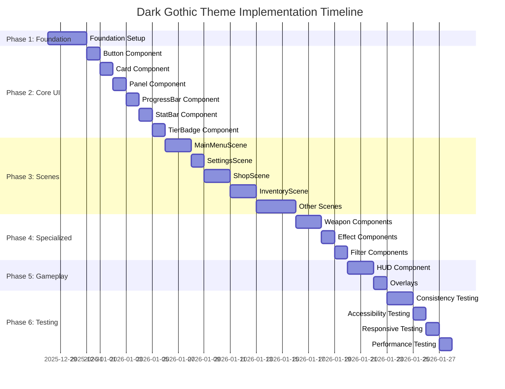

# Dark Gothic Theme Implementation Plan

## Overview
This document provides a comprehensive implementation plan for applying the Dark Gothic theme across the entire Ninja Slicer game. The plan is structured in phases to ensure systematic and incremental implementation.

## Current State Analysis

### Existing Theme Implementation
- Basic color constants already exist in `src/config/constants.ts` (lines 171-181)
- UI components use hardcoded colors and styles
- Button and Card components have basic theming support
- Existing UI assets are functional but not theme-compliant

### Theme Requirements
- **Color Palette**: Dark Red (#8B0000), Dark Purple (#4A0080), Gold (#FFD700), Dark Blue-Gray (#1A1A2E)
- **Typography**: Arial Black (primary), Georgia (secondary), Courier New (monospace)
- **Spacing**: 8px base unit, 12-column grid system
- **Animations**: 200ms duration, Power2 easing

## Implementation Phases

## Phase 1: Foundation Setup
**Objective**: Create the theme infrastructure and configuration

### Tasks:
1. **Create Theme Configuration Files**
   - File: `src/config/theme.ts` (new)
   - Content: Complete theme system with all color palette, typography, spacing, and animation constants
   - Code structure:
     ```typescript
     export const DARK_GOTHIC_THEME = {
       colors: {
         primary: 0x8B0000,
         secondary: 0x4A0080,
         accent: 0xFFD700,
         background: 0x1A1A2E,
         text: 0xFFFFFF,
         textSecondary: 0xCCCCCC,
         disabled: 0x666666,
         danger: 0xFF4444,
         success: 0x44FF44,
         warning: 0xFFAA00,
         bloodRed: 0xB80000,
         vampirePurple: 0x6A0DAD,
         ghostlyBlue: 0x00A8CC,
         demonGreen: 0x008000,
         holyWhite: 0xF5F5F5
       },
       fonts: {
         primary: 'Arial Black',
         secondary: 'Georgia',
         monospace: 'Courier New'
       },
       spacing: {
         unit: 8,
         small: 8,
         medium: 16,
         large: 24,
         xlarge: 32
       },
       animations: {
         duration: 200,
         easing: 'Power2',
         hoverScale: 1.02,
         pressScale: 0.98
       }
     };
     ```

2. **Define Theme Interfaces and Types**
   - File: `src/config/types.ts` (extend)
   - Add theme-related interfaces:
     ```typescript
     export interface ThemeColors {
       primary: number;
       secondary: number;
       accent: number;
       background: number;
       text: number;
       textSecondary: number;
       disabled: number;
       danger: number;
       success: number;
       warning: number;
       bloodRed: number;
       vampirePurple: number;
       ghostlyBlue: number;
       demonGreen: number;
       holyWhite: number;
     }

     export interface ThemeTypography {
       primary: string;
       secondary: string;
       monospace: string;
     }

     export interface ThemeSpacing {
       unit: number;
       small: number;
       medium: number;
       large: number;
       xlarge: number;
     }

     export interface ThemeAnimations {
       duration: number;
       easing: string;
       hoverScale: number;
       pressScale: number;
     }

     export interface ThemeConfig {
       colors: ThemeColors;
       fonts: ThemeTypography;
       spacing: ThemeSpacing;
       animations: ThemeAnimations;
     }
     ```

3. **Create Theme Manager**
   - File: `src/managers/ThemeManager.ts` (new)
   - Content: Centralized theme management system
   - Key features:
     - Theme switching capability
     - Theme validation
     - Accessibility checks (contrast ratios)
     - Responsive theme adjustments

4. **Update Existing Constants**
   - File: `src/config/constants.ts`
   - Replace hardcoded colors with theme references
   - Update UI animation constants to match theme specifications

### Dependencies:
- None (foundation phase)

### Risk Assessment:
- **Low Risk**: Creating new files and interfaces
- **Mitigation**: Use TypeScript interfaces for type safety
- **Rollback**: Easy to revert as new files only

### Estimated Effort:
- 2-3 hours for complete foundation setup

## Phase 2: Core UI Components
**Objective**: Update all core UI components to use the theme system

### Tasks:

#### 1. Button Component (`src/ui/Button.ts`)
**Changes needed:**
- Replace hardcoded colors with theme references
- Update font family to use theme typography
- Apply theme-specific animations
- Add theme-aware styling for different button types

**Specific modifications:**
```typescript
// Replace hardcoded colors
this.background = scene.add.rectangle(0, 0, width, height, theme.colors.primary);
this.text = scene.add.text(0, 0, text, {
  fontFamily: theme.fonts.primary,
  fontSize: `${fontSize}px`,
  color: '#' + theme.colors.text.toString(16),
  fontStyle: 'bold',
  stroke: '#000000',
  strokeThickness: 3
});
```

#### 2. Card Component (`src/ui/Card.ts`)
**Changes needed:**
- Update background and border colors to match theme
- Apply theme typography
- Update locked/selected states with theme colors
- Ensure consistent spacing using theme spacing units

**Specific modifications:**
```typescript
// Update card styling
this.background = scene.add.rectangle(0, 0, width, height, theme.colors.background);
this.background.setAlpha(0.9);
this.border = scene.add.rectangle(0, 0, width, height);
this.border.setStrokeStyle(3, theme.colors.accent);
```

#### 3. Panel Component (`src/ui/Panel.ts`)
**Changes needed:**
- Apply theme background and border colors
- Update title bar styling
- Ensure draggable functionality maintains theme consistency

#### 4. ProgressBar Component (`src/ui/ProgressBar.ts`)
**Changes needed:**
- Update background and fill colors
- Apply theme-appropriate gradient for fill
- Update border styling
- Ensure text uses theme typography

#### 5. StatBar Component (`src/ui/StatBar.ts`)
**Changes needed:**
- Apply theme colors for different stat types
- Update background transparency
- Ensure labels use theme typography

#### 6. TierBadge Component (`src/ui/TierBadge.ts`)
**Changes needed:**
- Update tier colors to match theme palette
- Apply theme typography
- Ensure consistent styling across tiers

### Dependencies:
- Phase 1: Foundation Setup must be complete

### Risk Assessment:
- **Medium Risk**: Modifying existing UI components
- **Mitigation**: Create backup of original files before changes
- **Rollback**: Can revert to original files if issues arise

### Estimated Effort:
- 4-6 hours for all core UI components

## Phase 3: Scene Implementation
**Objective**: Apply theme to all game scenes in priority order

### Priority Order:
1. **High Priority Scenes** (First impression, frequently accessed)
   - `src/scenes/MainMenuScene.ts`
   - `src/scenes/SettingsScene.ts`

2. **Medium Priority Scenes** (Gameplay-related)
   - `src/scenes/ShopScene.ts`
   - `src/scenes/InventoryScene.ts`
   - `src/scenes/CharacterScene.ts`
   - `src/scenes/LevelSelectScene.ts`
   - `src/scenes/WorldSelectScene.ts`

3. **Low Priority Scenes** (Less frequently accessed)
   - `src/scenes/LeaderboardScene.ts`
   - `src/scenes/PauseScene.ts`
   - `src/scenes/GameOverScene.ts`
   - `src/scenes/LevelCompleteScene.ts`

### Implementation Details per Scene:

#### MainMenuScene
**Theme elements to apply:**
- Background: Dark Blue-Gray (#1A1A2E)
- Title: Gold (#FFD700) with Dark Red (#8B0000) shadow
- Buttons: Primary style with theme colors
- Navigation: Gold accents

**Specific UI components to update:**
- Title text and logo
- Main menu buttons (Play, Settings, Shop, etc.)
- Background elements

#### SettingsScene
**Theme elements to apply:**
- Panel background: Semi-transparent Dark Blue-Gray
- Settings categories: Gold dividers
- Toggle switches: Theme-appropriate colors
- Slider controls: Gold handles on dark tracks

**Specific UI components to update:**
- Settings panel
- Audio controls (sliders, toggles)
- Gameplay settings (checkboxes, dropdowns)

#### ShopScene
**Theme elements to apply:**
- Weapon cards: Dark backgrounds with gold borders
- Currency display: Gold text
- Purchase buttons: Primary theme colors
- Weapon tiers: Theme-specific colors

**Specific UI components to update:**
- Weapon grid layout
- Currency display
- Purchase/sell buttons
- Weapon detail panels

#### InventoryScene
**Theme elements to apply:**
- Inventory grid: Dark background with gold borders
- Weapon cards: Consistent with theme
- Filter controls: Theme-appropriate styling
- Stats display: Monospace font for numbers

**Specific UI components to update:**
- Inventory grid
- Weapon cards
- Filter bar
- Stats panels

### Dependencies:
- Phase 1: Foundation Setup
- Phase 2: Core UI Components

### Risk Assessment:
- **Medium-High Risk**: Scene modifications can affect gameplay
- **Mitigation**: Test each scene individually before proceeding
- **Rollback**: Use git branches for scene-specific changes

### Estimated Effort:
- 8-12 hours for all scenes (varies by complexity)

## Phase 4: Specialized UI Components
**Objective**: Update specialized weapon and gameplay UI components

### Tasks:

#### 1. WeaponCard (`src/ui/WeaponCard.ts`)
**Changes needed:**
- Apply theme colors for weapon tiers
- Update elemental indicators (fire, ice, etc.)
- Ensure stats display uses monospace font
- Apply theme-appropriate borders and backgrounds

#### 2. WeaponPreview (`src/ui/WeaponPreview.ts`)
**Changes needed:**
- Update preview background
- Apply theme colors for weapon effects
- Ensure consistent styling with WeaponCard

#### 3. EffectivenessChart (`src/ui/EffectivenessChart.ts`)
**Changes needed:**
- Update chart colors to match theme
- Apply theme typography for labels
- Ensure monster type colors match theme palette

#### 4. EffectCard (`src/ui/EffectCard.ts`)
**Changes needed:**
- Apply theme colors for different effect types
- Update icons to match theme style
- Ensure consistent spacing

#### 5. FilterBar (`src/ui/FilterBar.ts`)
**Changes needed:**
- Update filter buttons with theme colors
- Apply theme typography
- Ensure selected state uses theme accent colors

#### 6. ComparisonView (`src/ui/ComparisonView.ts`)
**Changes needed:**
- Apply theme colors for comparison elements
- Update stat displays with monospace font
- Ensure consistent spacing and layout

#### 7. WeaponDetailsModal (`src/ui/WeaponDetailsModal.ts`)
**Changes needed:**
- Update modal background and borders
- Apply theme typography throughout
- Ensure weapon stats use appropriate colors

### Dependencies:
- Phase 1: Foundation Setup
- Phase 2: Core UI Components

### Risk Assessment:
- **Medium Risk**: Specialized components may have complex interactions
- **Mitigation**: Test each component in isolation first
- **Rollback**: Component-specific backups

### Estimated Effort:
- 6-8 hours for all specialized components

## Phase 5: HUD and Gameplay UI
**Objective**: Update in-game UI elements to match theme

### Tasks:

#### HUD Component (`src/ui/HUD.ts`)
**Changes needed:**
- Apply theme colors to all HUD elements
- Update health/soul displays with theme colors
- Ensure score/combo text uses theme typography
- Apply theme-appropriate borders and backgrounds

**Specific elements:**
- Health bar: Blood Red (#B80000) fill
- Soul counter: Gold (#FFD700) text
- Score display: White (#FFFFFF) with black stroke
- Combo meter: Gradient from Dark Red to Bright Red

#### In-game Overlays
**Changes needed:**
- Pause menu: Theme-consistent styling
- Game over screen: Dark Gothic aesthetic
- Level complete: Gold accents and dark backgrounds
- Notifications: Theme-appropriate colors

### Dependencies:
- Phase 1: Foundation Setup
- Phase 2: Core UI Components

### Risk Assessment:
- **High Risk**: HUD changes affect core gameplay
- **Mitigation**: Extensive testing in gameplay scenarios
- **Rollback**: Maintain backup of original HUD implementation

### Estimated Effort:
- 4-6 hours for HUD and gameplay UI

## Phase 6: Testing and Refinement
**Objective**: Ensure theme consistency and quality across all components

### Tasks:

#### 1. Theme Consistency Testing
**Checklist:**
- [ ] All colors match theme palette exactly
- [ ] Typography is consistent across all components
- [ ] Spacing follows 8px base unit rule
- [ ] Animations use 200ms duration and Power2 easing
- [ ] All UI states (normal, hover, pressed, disabled) are properly styled

#### 2. Accessibility Testing
**Checklist:**
- [ ] Color contrast ratios meet WCAG standards (4.5:1 minimum)
- [ ] Text is readable on all backgrounds
- [ ] Interactive elements have minimum 48x48px touch targets
- [ ] Keyboard navigation works for all UI elements
- [ ] Screen reader support for critical elements

#### 3. Responsive Design Testing
**Checklist:**
- [ ] UI adapts to different screen sizes
- [ ] Layout maintains theme consistency on mobile
- [ ] Touch controls are appropriately sized
- [ ] Text remains readable on small screens

#### 4. Performance Testing
**Checklist:**
- [ ] No performance impact from theme changes
- [ ] Animations run smoothly at 60fps
- [ ] Memory usage remains within acceptable limits
- [ ] Load times not affected by new assets

### Dependencies:
- All previous phases must be complete

### Risk Assessment:
- **Low Risk**: Testing phase identifies issues before release
- **Mitigation**: Comprehensive test coverage
- **Rollback**: Fix issues before final implementation

### Estimated Effort:
- 6-8 hours for comprehensive testing

## Migration Strategy

### UI Asset Handling
**Approach:** Create new theme-compliant assets while maintaining backward compatibility

**Specific actions:**
1. Create new button assets with Dark Gothic styling
2. Generate theme-appropriate panel backgrounds
3. Update icons to use gold (#FFD700) color scheme
4. Maintain original asset names for compatibility
5. Add new theme-specific assets as needed

### Implementation Approach
**Gradual Rollout Strategy:**
1. **Phase 1**: Implement foundation (no visible changes)
2. **Phase 2**: Update core UI components (test in isolation)
3. **Phase 3**: Apply to high-priority scenes first
4. **Phase 4**: Update specialized components
5. **Phase 5**: Apply to gameplay UI
6. **Phase 6**: Comprehensive testing and refinement

### Backward Compatibility
- Maintain original functionality throughout
- Use feature flags for theme switching if needed
- Ensure all existing game mechanics work unchanged
- Preserve save game compatibility

### Risk Mitigation
- **Version Control**: Use git branches for each phase
- **Backup Strategy**: Maintain backups of original files
- **Incremental Testing**: Test after each component update
- **User Feedback**: Gather feedback during development

## Implementation Timeline



## File Modification Summary

### New Files to Create:
- `src/config/theme.ts` - Theme configuration
- `src/managers/ThemeManager.ts` - Theme management system
- `src/utils/ThemeUtils.ts` - Theme utility functions

### Files to Modify:
- `src/config/constants.ts` - Update with theme references
- `src/config/types.ts` - Add theme interfaces
- `src/ui/Button.ts` - Apply theme styling
- `src/ui/Card.ts` - Apply theme styling
- `src/ui/Panel.ts` - Apply theme styling
- `src/ui/ProgressBar.ts` - Apply theme styling
- `src/ui/StatBar.ts` - Apply theme styling
- `src/ui/TierBadge.ts` - Apply theme styling
- `src/ui/WeaponCard.ts` - Apply theme styling
- `src/ui/WeaponPreview.ts` - Apply theme styling
- `src/ui/EffectivenessChart.ts` - Apply theme styling
- `src/ui/EffectCard.ts` - Apply theme styling
- `src/ui/FilterBar.ts` - Apply theme styling
- `src/ui/ComparisonView.ts` - Apply theme styling
- `src/ui/WeaponDetailsModal.ts` - Apply theme styling
- `src/ui/HUD.ts` - Apply theme styling
- All scene files in `src/scenes/` - Apply theme to scene-specific UI

### UI Assets to Update:
- Create new theme-compliant button assets
- Update panel backgrounds
- Modify icons to use gold color scheme
- Generate theme-appropriate borders and decorations

## Quality Assurance Checklist

### Visual Consistency
- [ ] All colors match the Dark Gothic palette exactly
- [ ] Typography is consistent across all components
- [ ] Spacing follows the 8px base unit system
- [ ] Animations use 200ms duration and Power2 easing
- [ ] UI states are visually distinct and consistent

### Functional Requirements
- [ ] All UI components remain functional
- [ ] Gameplay is unaffected by theme changes
- [ ] Performance meets or exceeds original standards
- [ ] Save/load functionality works correctly
- [ ] All game mechanics operate as expected

### Accessibility Compliance
- [ ] Color contrast ratios meet WCAG AA standards
- [ ] Text is readable on all backgrounds
- [ ] Interactive elements are properly sized
- [ ] Keyboard navigation works throughout
- [ ] Screen reader support for critical elements

### Cross-Platform Compatibility
- [ ] Theme works on desktop browsers
- [ ] Theme works on mobile devices
- [ ] Theme works in different orientations
- [ ] Touch controls are appropriately sized
- [ ] Performance is consistent across platforms

## Conclusion

This comprehensive implementation plan provides a systematic approach to applying the Dark Gothic theme across the entire Ninja Slicer game. By following the phased approach, the development team can ensure consistent quality, maintain backward compatibility, and systematically address any issues that arise during implementation.

The plan prioritizes foundational work first, followed by core UI components, then scenes in order of importance, and finally specialized components and gameplay UI. This approach ensures that the most critical elements are addressed early and provides a solid foundation for subsequent phases.

With proper execution of this plan, Ninja Slicer will have a cohesive, professional Dark Gothic theme that enhances the game's supernatural/horror atmosphere while maintaining excellent usability and accessibility.