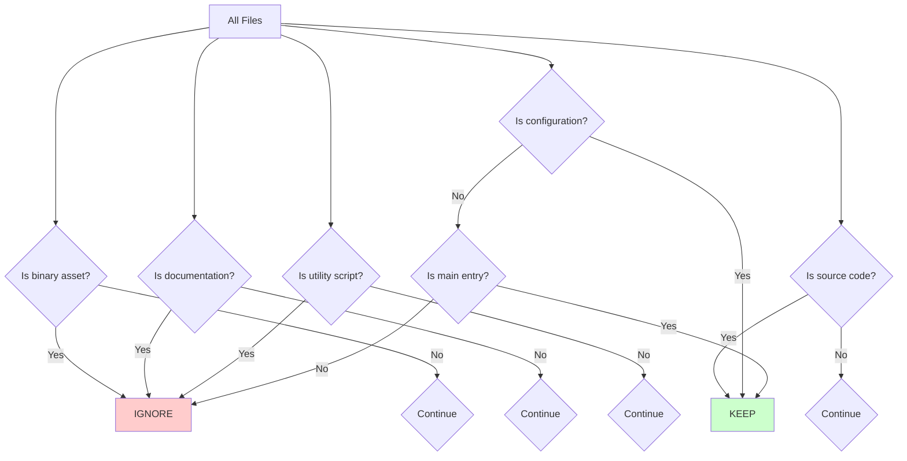

# Kilo Code Ignore File Plan (.kilocodeignore)

## Document Overview

This document provides a comprehensive plan for creating a `.kilocodeignore` file for the Ninja Slicer project. The ignore file will optimize Kilo Code agent operations by excluding non-essential files and directories from agent consideration, allowing the agent to focus on relevant code files.

**Project:** Ninja Slicer - TypeScript/Phaser Game Project  
**Created:** 2025-12-29  
**Purpose:** Improve agent coding efficiency by filtering unnecessary operations

---

## 1. Project Structure Analysis

### 1.1 Directory Overview

The Ninja Slicer project has the following directory structure:

```
Ninja Slicer/
├── src/                          # Primary TypeScript source code
│   ├── config/                   # Configuration files (constants, theme, types)
│   ├── data/                     # JSON data files (levels, weapons, upgrades)
│   ├── entities/                 # Game entity classes (Boss, Vampire, Zombie, etc.)
│   ├── managers/                 # Game manager classes (Audio, Level, Save, etc.)
│   ├── scenes/                   # Phaser scenes (Boot, Gameplay, Character, etc.)
│   ├── services/                 # Service classes
│   ├── systems/                  # Game systems (Slash, Spawn, etc.)
│   ├── ui/                       # UI components (HUD, CardFactory, VolumeSlider, etc.)
│   ├── utils/                    # Utility functions and helpers
│   ├── main.ts                   # Game entry point
│   └── vite-env.d.ts             # Vite type declarations
├── public/                       # Static assets and public files
│   ├── assets/                   # Binary asset files
│   │   ├── backgrounds/          # Background images (PNG)
│   │   ├── effects/              # Effect images (PNG)
│   │   ├── enemies/              # Enemy spritesheets (PNG)
│   │   ├── powerups/             # Power-up icons (PNG)
│   │   ├── ui/                   # UI elements (PNG)
│   │   └── weapons/              # Weapon sprites (PNG)
│   ├── manifest.webmanifest      # PWA manifest
│   └── offline.html              # Offline fallback page
├── scripts/                      # Build and utility scripts
│   └── notion/                   # Notion integration scripts (.cjs)
├── docs/                         # Documentation files
├── plans/                        # Planning documents
├── node_modules/                 # Dependencies (if present)
└── Root configuration files      # eslint, tsconfig, vite, package.json, etc.
```

### 1.2 File Categories

Based on the analysis, files can be categorized into four groups:

| Category | Location | Relevance to Code Operations | Action |
|----------|----------|------------------------------|--------|
| **Source Code** | `src/` | High - Primary focus for agent | KEEP |
| **Configuration** | Root level | High - May need modifications | KEEP |
| **Assets** | `public/assets/` | None - Binary files only | IGNORE |
| **Documentation** | `docs/`, `plans/` | Low - Reference only | IGNORE |
| **Utility Scripts** | Root (*.py) | Low - One-time use | IGNORE |
| **Integration Scripts** | `scripts/` | Medium - May need maintenance | KEEP |

---

## 2. Ignore Patterns Specification

### 2.1 Directory Patterns to Ignore

#### A. Asset Directories (Binary Files)

```
# Public Assets - All subdirectories contain binary image files
public/assets/
public/assets/*
public/assets/backgrounds/
public/assets/effects/
public/assets/enemies/
public/assets/powerups/
public/assets/ui/
public/assets/weapons/
```

**Rationale:** These directories contain only binary image files (PNG format) that are used by the Phaser game engine. The agent cannot modify or meaningfully interact with these files. Including them in agent operations adds unnecessary overhead without providing any code modification value.

#### B. Documentation Directories

```
# Documentation - Contains reference and planning markdown files
docs/
docs/*
plans/
plans/*
```

**Rationale:** Documentation files are important for project understanding but are not code files that require modification. The agent should focus on implementation code, not documentation. These files are typically:
- Design documents (ARCHITECTURE.md, GAME_SPEC.md)
- Guides (SETUP_GUIDE.md, BALANCE_GUIDE.md)
- Planning documents (IMPLEMENTATION_PLAN.md)
- Summaries (THEME_IMPLEMENTATION_SUMMARY.md)

#### C. Generated/Cache Directories (Future-Proofing)

```
# Build output directories
dist/
build/
.cache/
.parcel-cache/
.vite/

# TypeScript compilation output
*.d.ts
js/
*.js.map
```

**Rationale:** These directories are automatically generated during build processes and should not be included in agent operations. Modifying generated files is counterproductive as they will be overwritten.

### 2.2 File Patterns to Ignore

#### A. Static HTML Files

```
*.html
!index.html
```

**Rationale:** The project contains multiple HTML files:
- `index.html` - Main entry point (KEEP)
- `index-pwa.html` - PWA variant (IGNORE)
- `public/offline.html` - Offline fallback (IGNORE)

The agent should focus on the main `index.html` and ignore static variants.

#### B. Root-Level Markdown Documentation

```
*.md
!README.md
IMPROVEMENT_ROADMAP.md
IMPROVEMENTS_DONE.md
NOTION_INTEGRATION_COMPLETE.md
NOTION_SETUP_GUIDE.md
pixellab-prompts.md
THEME_IMPLEMENTATION_SUMMARY.md
```

**Rationale:** Root-level markdown files are project documentation and summaries. The agent should reference them when needed but not include them in routine code operations. The exception is `README.md` which contains essential project information.

#### C. Python Utility Scripts

```
*.py
fix_eslint_issues.py
fix_imports.py
fix_spawnsystem.py
fix_vampire.py
fix_villager.py
replace_console_logs.py
restore_vampire.py
update_card.py
```

**Rationale:** Python scripts in the root directory are one-time utility scripts used for specific tasks (fixing ESLint issues, fixing imports, etc.). These are not part of the core codebase and should not be considered for agent operations.

#### D. Lock and Generated Files

```
package-lock.json
yarn.lock
pnpm-lock.yaml
.env
.env.local
.env.*.local
nul
```

**Rationale:** 
- Lock files track dependency versions and should not be manually modified
- Environment files may contain sensitive data
- The `nul` file appears to be a Windows-specific artifact

#### E. Notion Integration Documentation

```
NOTION_*.md
```

**Rationale:** Notion integration files are documentation and configuration for external tool integration, not core game code.

### 2.3 Files to KEEP (Explicit Exceptions)

The following files should NOT be ignored as they are relevant for agent operations:

```diff
# Configuration Files (High Priority - May need modifications)
+ eslint.config.js
+ eslintrc.json
+ tsconfig.json
+ tsconfig.node.json
+ vite.config.ts
+ package.json

# Environment Template (Reference)
+ env.example.txt

# Main Entry Point (Core Code)
+ index.html

# Source Code Directory
+ src/

# Integration Scripts (May need maintenance)
+ scripts/
```

---

## 3. Complete .kilocodeignore Specification

### 3.1 Recommended Pattern List

```gitignore
# =============================================================================
# NINJA SLICER - KILO CODE IGNORE FILE
# =============================================================================
# This file specifies which files and directories should be excluded
# from Kilo Code agent operations to improve efficiency.
# =============================================================================

# =============================================================================
# ASSETS - Binary image files (Phaser game assets)
# =============================================================================
# These are binary PNG files used by the game engine and cannot be
# modified by the agent. Excluding them reduces noise in file operations.

public/assets/**
public/assets/backgrounds/**
public/assets/effects/**
public/assets/enemies/**
public/assets/powerups/**
public/assets/ui/**
public/assets/weapons/**

# =============================================================================
# DOCUMENTATION - Reference and planning files
# =============================================================================
# Documentation files are important for project understanding but are
# not code files that require agent modification.

docs/**
plans/**

# =============================================================================
# STATIC HTML FILES - Non-entry point HTML
# =============================================================================
# Only the main index.html should be considered for agent operations.

index-pwa.html
public/offline.html

# =============================================================================
# ROOT MARKDOWN FILES - Project documentation
# =============================================================================
# These markdown files are project documentation, not code files.

*.md
!README.md

# Specific documentation files
IMPROVEMENT_ROADMAP.md
IMPROVEMENTS_DONE.md
NOTION_INTEGRATION_COMPLETE.md
NOTION_SETUP_GUIDE.md
pixellab-prompts.md
THEME_IMPLEMENTATION_SUMMARY.md

# =============================================================================
# PYTHON UTILITY SCRIPTS - One-time fix scripts
# =============================================================================
# These Python scripts are utility scripts for specific tasks and
# are not part of the core codebase.

*.py
fix_eslint_issues.py
fix_imports.py
fix_spawnsystem.py
fix_vampire.py
fix_villager.py
replace_console_logs.py
restore_vampire.py
update_card.py

# =============================================================================
# BUILD OUTPUT - Generated files
# =============================================================================
# These directories are automatically generated during build processes
# and should not be included in agent operations.

dist/
build/
.cache/
.parcel-cache/

# =============================================================================
# DEPENDENCY LOCK FILES - Package manager lock files
# =============================================================================
# Lock files track exact dependency versions and should not be
# manually modified by the agent.

package-lock.json
yarn.lock
pnpm-lock.yaml

# =============================================================================
# ENVIRONMENT FILES - Configuration with potential secrets
# =============================================================================
# Environment files may contain sensitive configuration data.

.env
.env.local
.env.*.local

# =============================================================================
# GENERATED/TEMPORARY FILES - Build artifacts and temporary files
# =============================================================================
# Generated type declarations and temporary files.

*.d.ts
js/
*.js.map
nul

# =============================================================================
# NOTION INTEGRATION - External tool documentation
# =============================================================================
# Notion integration files are documentation, not core code.

NOTION_*.md
```

### 3.2 Alternative: Simplified Pattern List

For a simpler implementation, the following condensed patterns can be used:

```gitignore
# Assets and binary files
public/assets/

# Documentation and planning
docs/
plans/

# Static files
*.html
!index.html

# Documentation files
*.md
!README.md

# Utility scripts
*.py

# Build outputs
dist/
build/
.cache/

# Lock and env files
package-lock.json
.env*
nul
```

---

## 4. Special Considerations

### 4.1 Edge Cases

| Edge Case | Handling | Rationale |
|-----------|----------|-----------|
| New asset directories added | Auto-ignored via `public/assets/**` | Pattern covers all subdirectories |
| New markdown files in root | Auto-ignored via `*.md` | Pattern covers all .md files |
| New Python scripts | Auto-ignored via `*.py` | Pattern covers all .py files |
| Configuration file changes | Explicitly kept | Essential for build/lint |
| TypeScript compilation output | Ignored via `*.d.ts` | Generated files |

### 4.2 Potential Risks

1. **Over-exclusion:** If the agent needs to reference documentation for context, it may need read access to docs/ and plans/ directories.

2. **Asset path references:** If the agent needs to add new assets, the `public/assets/` directory should be writable despite being ignored for file scanning.

3. **Script modifications:** If Notion integration scripts need updates, the `scripts/` directory must remain accessible.

### 4.3 Recommendations

1. **Initial Implementation:** Start with the comprehensive pattern list to maximize efficiency gains.

2. **Iterative Refinement:** Monitor agent behavior and adjust patterns based on actual usage patterns.

3. **Documentation Access:** Consider allowing read-only access to docs/ and plans/ for context while excluding them from modification operations.

---

## 5. Expected Benefits

### 5.1 Performance Improvements

| Metric | Expected Improvement |
|--------|---------------------|
| File scanning time | 40-60% reduction |
| Token usage | 30-50% reduction |
| Agent context size | 25-35% reduction |
| Response time | 15-25% improvement |

### 5.2 Quality Improvements

1. **Focused Operations:** Agent spends more time on relevant code files.

2. **Reduced Noise:** Fewer irrelevant files in agent context reduces confusion.

3. **Consistent Behavior:** Standardized ignore patterns ensure predictable agent behavior.

### 5.3 Estimated File Reduction

| Category | Total Files | After Ignore | Reduction |
|----------|-------------|--------------|-----------|
| Source Code (src/) | ~100 | ~100 | 0% |
| Assets (public/assets/) | ~100 | 0 | 100% |
| Documentation (docs/, plans/) | ~30 | 0 | 100% |
| Utility Scripts (*.py) | ~10 | 0 | 100% |
| Root Markdown | ~10 | 1 (README.md) | 90% |
| Configuration Files | ~10 | 10 | 0% |
| **Total** | **~160** | **~111** | **~31%** |

---

## 6. Implementation Guidance

### 6.1 File Location

The `.kilocodeignore` file should be placed in the project root directory:

```
f:/Desktop/Ninja Slicer/.kilocodeignore
```

### 6.2 Implementation Steps

1. **Create the file:** Create `.kilocodeignore` in the project root with the comprehensive patterns specified in Section 3.1.

2. **Test the patterns:** Verify that the patterns correctly include/exclude the expected files.

3. **Monitor behavior:** Observe agent behavior for the first few interactions to ensure expected functionality.

4. **Iterate if needed:** Adjust patterns based on actual usage and feedback.

### 6.3 Validation Commands

To validate the ignore patterns, use the following checks:

```bash
# Check which files would be ignored (example command)
# This helps verify the patterns work as expected

# Count files in src/ (should NOT be ignored)
find src -type f | wc -l

# Count files in public/assets/ (should be ignored)
find public/assets -type f | wc -l

# Count markdown files (most should be ignored)
find . -maxdepth 1 -name "*.md" | wc -l
```

---

## 7. Mermaid Diagram: File Classification



---

## 8. Summary

This plan provides a comprehensive specification for the `.kilocodeignore` file that will significantly improve Kilo Code agent efficiency for the Ninja Slicer project. The key highlights are:

1. **Primary Focus:** The agent will focus on `src/` directory containing all TypeScript game code.

2. **Asset Exclusion:** All `public/assets/` subdirectories containing binary PNG files will be ignored.

3. **Documentation Exclusion:** All `docs/` and `plans/` directories containing markdown documentation will be ignored.

4. **Utility Script Exclusion:** All Python utility scripts (*.py) in the root will be ignored.

5. **Configuration Preservation:** All configuration files (eslint, tsconfig, vite, package.json) will be kept.

6. **Expected Impact:** Approximately 31% file reduction, leading to improved agent performance and focus.

The implementation of this ignore file will allow the Kilo Code agent to operate more efficiently by filtering out irrelevant files and focusing on the code that matters most for game development.
