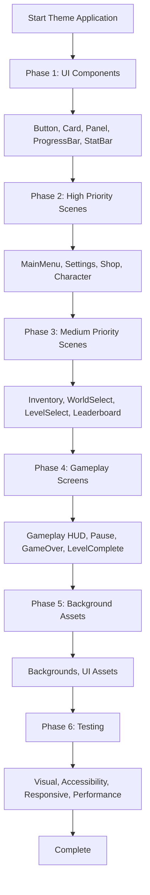

# Dark Gothic Theme Application Plan

## Executive Summary

The Dark Gothic theme foundation is already in place. This plan focuses on **applying** the theme consistently across all game screens, replacing hardcoded values with theme references, and ensuring visual coherence throughout the game.

**Current Status:**
- ✅ Theme configuration (`src/config/theme.ts`) - Complete
- ✅ Theme manager (`src/managers/ThemeManager.ts`) - Complete  
- ✅ Constants integration (`src/config/constants.ts`) - Complete
- 🔶 Theme application to scenes - Partial (MainMenuScene complete, others need work)

**Goal:** Apply Dark Gothic theme to all remaining scenes and UI components with consistent visual language.

---

## Theme Color Palette Reference

```typescript
// From src/config/theme.ts
const DARK_GOTHIC_THEME = {
  colors: {
    primary: 0x8B0000,        // Dark Red (blood)
    secondary: 0x4A0080,      // Dark Purple (vampire)
    accent: 0xFFD700,         // Gold (holy/treasure)
    background: 0x1A1A2E,     // Dark Blue-Gray (night sky)
    text: 0xFFFFFF,           // White
    textSecondary: 0xCCCCCC,  // Light Gray
    disabled: 0x666666,       // Gray
    danger: 0xFF4444,         // Red
    success: 0x44FF44,        // Green
    warning: 0xFFAA00,        // Orange
    bloodRed: 0xB80000,       // Blood red
    vampirePurple: 0x6A0DAD,  // Deep purple
    ghostlyBlue: 0x00A8CC,    // Ethereal blue
    demonGreen: 0x008000,     // Dark green
    holyWhite: 0xF5F5F5,      // Bright white
  },
  fonts: {
    primary: 'Arial Black',   // Titles
    secondary: 'Georgia',     // Body text
    monospace: 'Courier New', // Numbers/stats
  },
  spacing: {
    unit: 8,
    small: 8,
    medium: 16,
    large: 24,
    xlarge: 32,
  },
  animations: {
    duration: 200,  // ms
    easing: 'Power2',
    hoverScale: 1.02,
    pressScale: 0.98,
  },
};
```

---

## Phase 1: Core UI Component Updates

### Task 1.1: Button Component Enhancement
**File:** `src/ui/Button.ts`

**Changes:**
- [ ] Update PRIMARY style to use `theme.colors.primary` (dark red)
- [ ] Update SECONDARY style to use `theme.colors.secondary` (dark purple)
- [ ] Update ACCENT style to use `theme.colors.accent` (gold)
- [ ] Update DANGER style to use `theme.colors.danger`
- [ ] Update DISABLED style to use `theme.colors.disabled`
- [ ] Apply `theme.fonts.primary` to button text
- [ ] Apply `theme.animations` for hover/press effects
- [ ] Add gold border accent for primary buttons

**Code Pattern:**
```typescript
// Replace hardcoded colors with:
import { DARK_GOTHIC_THEME } from '../config/theme';

this.background = this.add.rectangle(0, 0, width, height, DARK_GOTHIC_THEME.colors.primary);
this.text = scene.add.text(0, 0, text, {
  fontFamily: DARK_GOTHIC_THEME.fonts.primary,
  fontSize: `${fontSize}px`,
  color: '#' + DARK_GOTHIC_THEME.colors.text.toString(16).padStart(6, '0'),
});
```

---

### Task 1.2: Card Component Enhancement
**File:** `src/ui/Card.ts`

**Changes:**
- [ ] Update background to use `theme.colors.background` with 0.9 alpha
- [ ] Apply gold border using `theme.colors.accent`
- [ ] Use `theme.fonts.secondary` for card text
- [ ] Update locked state to use `theme.colors.disabled`
- [ ] Update selected state to use `theme.colors.accent`
- [ ] Add subtle glow effect for rare/legendary cards

---

### Task 1.3: Panel Component Enhancement
**File:** `src/ui/Panel.ts`

**Changes:**
- [ ] Update background to semi-transparent `theme.colors.background`
- [ ] Apply gold border using `theme.colors.accent`
- [ ] Update title bar styling with `theme.colors.primary`
- [ ] Use `theme.fonts.primary` for panel titles
- [ ] Add drag handle styling

---

### Task 1.4: ProgressBar Component Enhancement
**File:** `src/ui/ProgressBar.ts`

**Changes:**
- [ ] Update background to `theme.colors.background`
- [ ] Apply gradient fill from `theme.colors.primary` to `theme.colors.accent`
- [ ] Update border color to `theme.colors.accent`
- [ ] Use `theme.fonts.monospace` for value text
- [ ] Add glow effect for full bars

---

### Task 1.5: StatBar Component Enhancement
**File:** `src/ui/StatBar.ts`

**Changes:**
- [ ] Update background to `theme.colors.background`
- [ ] Apply color coding:
  - High (80-100%): `theme.colors.success`
  - Medium (40-79%): `theme.colors.warning`
  - Low (0-39%): `theme.colors.danger`
- [ ] Use `theme.fonts.monospace` for stat values
- [ ] Add animated fill on value changes

---

## Phase 2: Scene Updates - Priority 1 (High Visibility)

### Task 2.1: MainMenuScene - Review & Polish
**File:** `src/scenes/MainMenuScene.ts`
**Status:** ✅ Already implementing theme correctly

**Review:**
- [x] Uses `DARK_GOTHIC_THEME` for logo colors
- [x] Uses `DARK_GOTHIC_THEME.fonts.primary` for text
- [x] Uses `DARK_GOTHIC_THEME.animations` for transitions
- [x] Background uses `theme.colors.background`

**Polish Tasks:**
- [ ] Add atmospheric particle effects (ghostly wisps) - use ParticleSystem.createGhostMist()
- [ ] Add subtle vignette overlay using graphics
- [ ] Enhance button hover effects with gold glow using AnimationManager
- [ ] Add pulsing glow to the title logo
- [ ] Add soul wisps floating in background

---

### Task 2.2: SettingsScene Theme Update
**File:** `src/scenes/SettingsScene.ts`

**Current State Analysis:**
- Line 100: Uses `COLORS.background` ✅
- Line 223: Hardcoded `0x333333` for slider background ❌
- Line 224: Hardcoded `0x666666` for slider border ❌
- Line 229: Uses `COLORS.success` ✅
- Line 234: Hardcoded `0xFFFFFF` for handle ❌
- Line 369, 377: Hardcoded green colors for status ❌
- Title stroke uses hardcoded `'#000000'` ❌

**Specific Changes Required:**

| Line | Current | Change To |
|------|---------|-----------|
| 223 | `0x333333` | `COLORS.background` |
| 224 | `0x666666` | `COLORS.textSecondary` |
| 234 | `0xFFFFFF` | `COLORS.accent` (gold handle) |
| 234 border | `0x000000` | `COLORS.primary` |
| 369, 377 | `'#00ff00'` | `COLORS.success` |
| 358 | `'#888888'` | `COLORS.textSecondary` |
| 108-119 | Title stroke | Use `DARK_GOTHIC_THEME.colors.primary` |

**New Theme Elements to Add:**
- [ ] Style section titles with `DARK_GOTHIC_THEME.fonts.primary` and gold accent
- [ ] Add gold dividers between sections
- [ ] Style sliders with gold handle on dark track
- [ ] Add hover animations using `theme.animations`
- [ ] Style cloud save status text with appropriate colors

**Expected Layout:**
```
┌─────────────────────────────────────────┐
│  SETTINGS                               │
├─────────────────────────────────────────┤
│  AUDIO                                  │
│  [Music: ████████████░░] 50%            │
│  [SFX:  ███████████████░] 80%           │
│  [Master: ██████████████░] 70%          │
├─────────────────────────────────────────┤
│  GAMEPLAY                               │
│  [✓] Show Blood Effects                 │
│  [✓] Screen Shake                       │
│  [ ] High Contrast Mode                 │
├─────────────────────────────────────────┤
│  DATA                                   │
│  [Sync to Cloud]  [Clear Save]          │
│  Last synced: Never                     │
├─────────────────────────────────────────┤
│  [BACK]                                 │
└─────────────────────────────────────────┘
```

**Component Updates:**
- [ ] Update Panel styling for confirmation dialogs
- [ ] Style Button hover states with gold accent
- [ ] Add gold border to active slider handle
- [ ] Use theme fonts for all text elements

---

### Task 2.3: ShopScene Theme Update
**File:** `src/scenes/ShopScene.ts`
**Status:** ⚠️ Uses COLORS but has hardcoded values

**Current State Analysis:**
- Line 99: Uses `COLORS.background` ✅
- Line 145: Hardcoded `'#FFD700'` for souls display ❌
- Line 267: Hardcoded `0x2a2a4a` for card background ❌
- Line 268: Uses `COLORS.accent` ✅
- Line 382: Hardcoded `0x2a2a4a` for upgrade card background ❌

**Specific Changes Required:**

| Line | Current | Change To |
|------|---------|-----------|
| 145 | `'#FFD700'` | Use `DARK_GOTHIC_THEME.colors.accent.toString(16)` |
| 267 | `0x2a2a4a` | `COLORS.background` |
| 382 | `0x2a2a4a` | `COLORS.background` |
| 107-117 | Title stroke | Use `DARK_GOTHIC_THEME.colors.primary` |

**New Theme Elements to Add:**
- [ ] Add gold accent borders to weapon cards (line 268 already uses accent)
- [ ] Style purchase buttons with gold hover effects
- [ ] Style tab buttons with theme colors (primary/secondary)
- [ ] Add hover animations using `theme.animations`
- [ ] Style souls display with gold text and glow effect
- [ ] Add gold dividers between weapon cards

**Code Fix Pattern:**
```typescript
// Replace hardcoded colors with:
const background = this.add.rectangle(0, 0, cardWidth, cardHeight, COLORS.background);

// Style souls display with theme:
this.soulsDisplay = this.add.text(..., {
  color: '#' + DARK_GOTHIC_THEME.colors.accent.toString(16).padStart(6, '0'),
});
```

---

### Task 2.4: CharacterScene Theme Update
**File:** `src/scenes/CharacterScene.ts`
**Status:** ⚠️ Uses COLORS but has hardcoded hex values

**Current State Analysis:**
- Line 147: Uses `COLORS.background` ✅
- Line 157-164: Hardcoded gradient colors for overlay ❌
- Line 224: Hardcoded shadow color `'#8b0000'` ❌
- Line 302: Hardcoded `0x2a2a4a` for panel background ❌
- Line 303: Uses `COLORS.accent` ✅
- Line 448: Hardcoded `0x2a2a4a` for effectiveness panel ❌

**Specific Changes Required:**

| Line | Current | Change To |
|------|---------|-----------|
| 157-164 | `0x1a1a2e`, `0x2a2a4a` | Use theme colors with alpha
| 224 | `'#8b0000'` | `DARK_GOTHIC_THEME.colors.primary.toString(16)` |
| 302 | `0x2a2a4a` | `COLORS.background` |
| 448 | `0x2a2a4a` | `COLORS.background` |

**New Theme Elements to Add:**
- [ ] Add gold borders to stat panels
- [ ] Style effectiveness chart with theme colors
- [ ] Add glow effects to weapon preview using particle system
- [ ] Apply theme animations to UI element transitions
- [ ] Style effect cards with themed borders
- [ ] Add atmospheric particles (ghostly wisps)

**Code Fix Pattern:**
```typescript
// Replace hardcoded panel background:
const panelBg = this.add.rectangle(0, 0, 300, 400, COLORS.background);
panelBg.setStrokeStyle(2, COLORS.accent);
panelBg.setAlpha(0.9);

// Use theme colors for gradient:
gradient.fillGradientStyle(
  DARK_GOTHIC_THEME.colors.background,
  DARK_GOTHIC_THEME.colors.background,
  DARK_GOTHIC_THEME.colors.secondary,
  DARK_GOTHIC_THEME.colors.secondary,
  0.3
);
```

---

## Phase 3: Scene Updates - Priority 2 (Medium Visibility)

### Task 3.1: InventoryScene Theme Update
**File:** `src/scenes/InventoryScene.ts`

**Current State Analysis:**
- Line 127: Uses `COLORS.background` ✅
- Line 132-134: Hardcoded gradient colors ❌
- Line 149: Hardcoded stroke `'#8b0000'` ❌
- Line 498: Hardcoded `'#44ff44'` for can afford ❌
- Line 498: Hardcoded `'#ff4444'` for cannot afford ❌
- Line 773: Hardcoded `0x8b0000` for particle tint ❌
- Line 836: Hardcoded `'#ffd700'` for unlock message ❌
- Line 868: Hardcoded `'#44aaff'` for upgrade message ❌

**Specific Changes Required:**

| Line | Current | Change To |
|------|---------|-----------|
| 132-134 | `0x1a1a2e`, `0x2a2a4a` | Use theme colors with alpha |
| 149 | `'#8b0000'` | `DARK_GOTHIC_THEME.colors.primary.toString(16)` |
| 498 | `'#44ff44'` | `COLORS.success` |
| 498 | `'#ff4444'` | `COLORS.danger` |
| 773 | `0x8b0000` | `DARK_GOTHIC_THEME.colors.bloodRed` |
| 836 | `'#ffd700'` | `DARK_GOTHIC_THEME.colors.accent.toString(16)` |
| 868 | `'#44aaff'` | `DARK_GOTHIC_THEME.colors.ghostlyBlue.toString(16)` |

**New Theme Elements to Add:**
- [ ] Style weapon grid with gold borders
- [ ] Apply theme to FilterBar buttons
- [ ] Add hover effects using `theme.animations`
- [ ] Style locked weapons with `COLORS.disabled`
- [ ] Add gold accents to equipped weapon highlights
- [ ] Style pagination buttons with theme colors
- [ ] Add atmospheric particle effects (soul wisps)
- [ ] Style message popups with themed colors

**Code Fix Pattern:**
```typescript
// Replace gradient:
gradient.fillGradientStyle(
  DARK_GOTHIC_THEME.colors.background,
  DARK_GOTHIC_THEME.colors.background,
  DARK_GOTHIC_THEME.colors.secondary,
  DARK_GOTHIC_THEME.colors.secondary,
  0.3
);

// Style particle tint:
tint: DARK_GOTHIC_THEME.colors.bloodRed,

// Message colors:
color: '#' + COLORS.success.toString(16).padStart(6, '0'),
```

---

### Task 3.2: WorldSelectScene Theme Update
**File:** `src/scenes/WorldSelectScene.ts`

**Changes:**
- [ ] Update background to `theme.colors.background`
- [ ] Style world cards with gold borders (using `COLORS.accent`)
- [ ] Add gold accents for unlocked worlds
- [ ] Use `COLORS.danger` for locked worlds
- [ ] Style completion percentage display with gold
- [ ] Apply theme to navigation arrows
- [ ] Add atmospheric background elements
- [ ] Style world preview images with themed borders

**Theme Color Usage:**
```typescript
// Unlocked world card
card.setStrokeStyle(2, COLORS.accent); // Gold border
card.setAlpha(1.0);

// Locked world card
card.setStrokeStyle(2, COLORS.disabled); // Gray border
card.setAlpha(0.6);

// Completion text
completionText.setColor('#' + COLORS.accent.toString(16).padStart(6, '0'));
```

---

### Task 3.3: LevelSelectScene Theme Update
**File:** `src/scenes/LevelSelectScene.ts`

**Changes:**
- [ ] Update background to `theme.colors.background`
- [ ] Style level card with gold borders
- [ ] Apply theme to star ratings (gold for earned, gray for unearned)
- [ ] Style lock icons with `COLORS.disabled`
- [ ] Add boss indicator styling with `COLORS.danger`
- [ ] Apply theme to navigation buttons
- [ ] Style level number display
- [ ] Add hover animations using `theme.animations`

---

### Task 3.4: LeaderboardScene Theme Update
**File:** `src/scenes/LeaderboardScene.ts`

**Changes:**
- [ ] Update background to `theme.colors.background`
- [ ] Style table headers with gold accents and `COLORS.primary` background
- [ ] Apply alternating row colors (semi-transparent background)
- [ ] Highlight player's entries with `COLORS.accent` highlight
- [ ] Style tab buttons (All-Time, Weekly, Personal) with theme colors
- [ ] Add gold borders to entries
- [ ] Apply theme to navigation buttons
- [ ] Style rank numbers with themed colors

---

## Phase 4: Scene Updates - Priority 3 (Gameplay Screens)

### Task 4.1: GameplayScene HUD Theme Update
**File:** `src/scenes/GameplayScene.ts`

**Current State Analysis:**
- Line 323: Uses pure black `0x000000` for background ❌
- Line 327: Uses `0x0a0a0a` for decorative elements ❌

**Specific Changes Required:**

| Line | Current | Change To |
|------|---------|-----------|
| 323 | `0x000000` | `DARK_GOTHIC_THEME.colors.background` |
| 327 | `0x0a0a0a` | `DARK_GOTHIC_THEME.colors.primary` with low alpha |

**HUD Elements to Theme (in `src/ui/HUD.ts`):**
- [ ] Update health bar to `DARK_GOTHIC_THEME.colors.bloodRed`
- [ ] Style soul counter with `DARK_GOTHIC_THEME.colors.accent`
- [ ] Apply theme to score display
- [ ] Style combo counter with gold accents (pulse animation)
- [ ] Update pause button styling
- [ ] Add theme to power-up indicators
- [ ] Style boss health bar with `COLORS.danger`
- [ ] Apply theme animations to HUD updates

**Color Reference for HUD:**
```typescript
// Health bar - blood red
healthBar.setFillStyle(DARK_GOTHIC_THEME.colors.bloodRed);

// Souls - gold
soulsText.setColor('#' + DARK_GOTHIC_THEME.colors.accent.toString(16).padStart(6, '0'));

// Combo - pulse with accent
comboText.setColor('#' + DARK_GOTHIC_THEME.colors.accent.toString(16).padStart(6, '0'));
comboText.setScale(1.1); // Pulse effect

// Boss health bar
bossHealthBar.setFillStyle(DARK_GOTHIC_THEME.colors.danger);
```

---

### Task 4.2: PauseScene Theme Update
**File:** `src/scenes/PauseScene.ts`

**Changes:**
- [ ] Style pause overlay with `theme.colors.background` (0.8 alpha)
- [ ] Apply gold borders to panel using `COLORS.accent`
- [ ] Style title with `DARK_GOTHIC_THEME.fonts.primary` and gold stroke
- [ ] Style all buttons with theme colors
- [ ] Add dim background effect
- [ ] Apply theme animations to panel appearance (slide in)
- [ ] Style menu options with themed hover effects

**Expected Layout:**
```
┌─────────────────────────────────────────┐
│         ┌─────────────────────────┐     │
│         │       PAUSED            │     │
│         ├─────────────────────────┤     │
│         │       RESUME            │     │
│         │       RESTART           │     │
│         │       SETTINGS          │     │
│         │       QUIT TO MENU      │     │
│         └─────────────────────────┘     │
└─────────────────────────────────────────┘
```

---

### Task 4.3: GameOverScene Theme Update
**File:** `src/scenes/GameOverScene.ts`

**Changes:**
- [ ] Update background to dark, dramatic theme (use `COLORS.primary` with low alpha)
- [ ] Style "GAME OVER" text with blood red and gold
  - Text color: `DARK_GOTHIC_THEME.colors.danger`
  - Stroke: `DARK_GOTHIC_THEME.colors.accent`
- [ ] Apply theme to stat displays (use monospace font)
- [ ] Style retry button with `COLORS.primary`
- [ ] Style menu button with `COLORS.secondary`
- [ ] Add dramatic fade-in animations
- [ ] Style souls earned display with gold
- [ ] Add screen shake effect on game over

**Theme Styling for Game Over:**
```typescript
// Game Over title
gameOverText.setColor('#' + DARK_GOTHIC_THEME.colors.danger.toString(16).padStart(6, '0'));
gameOverText.setStrokeStyle(4, DARK_GOTHIC_THEME.colors.accent);

// Souls earned
soulsText.setColor('#' + DARK_GOTHIC_THEME.colors.accent.toString(16).padStart(6, '0'));
```

---

### Task 4.4: LevelCompleteScene Theme Update
**File:** `src/scenes/LevelCompleteScene.ts`

**Changes:**
- [ ] Style "LEVEL COMPLETE" text with gold accents
  - Text color: `DARK_GOTHIC_THEME.colors.accent`
  - Stroke: `DARK_GOTHIC_THEME.colors.primary`
- [ ] Apply theme to star reveal animation (gold stars)
- [ ] Style score display with white text, gold stroke
- [ ] Style souls earned with `COLORS.accent`
- [ ] Style navigation buttons
- [ ] Add celebratory particle effects (gold sparkles)
- [ ] Apply theme animations to results panel (bounce in)
- [ ] Style score breakdown with themed colors

---

### Task 4.5: EndlessGameplayScene Theme Update
**File:** `src/scenes/EndlessGameplayScene.ts`

**Changes:**
- [ ] Update background to `theme.colors.background`
- [ ] Apply all HUD theming from Task 4.1
- [ ] Style endless mode specific UI (difficulty indicator)
- [ ] Apply theme to score display
- [ ] Style power-up indicators
- [ ] Add atmospheric effects appropriate for endless play

---

### Task 4.6: PreloaderScene Theme Update
**File:** `src/scenes/PreloaderScene.ts`

**Changes:**
- [ ] Style loading bar with theme colors
- [ ] Add loading text with themed font
- [ ] Style progress fill with `COLORS.accent`
- [ ] Add atmospheric loading background
- [ ] Apply theme animations to loading progress

---

## Phase 5: Background & Visual Assets

### Task 5.1: Background Asset Review
**Files:** `public/assets/backgrounds/`

**Current Assets:**
- [x] `menu.png` - Used in MainMenuScene
- [x] `graveyard.png` - World 1
- [x] `haunted_village.png` - World 2
- [x] `vampire_castle.png` - World 3
- [x] `ghost_realm.png` - World 4
- [x] `hell_dimension.png` - World 5

**Actions:**
- [ ] Verify all backgrounds match Dark Gothic aesthetic
- [ ] Add subtle vignette overlay to each background
- [ ] Ensure foreground layers use consistent color palette
- [ ] Test backgrounds for theme consistency

---

### Task 5.2: UI Asset Updates
**Files:** `public/assets/ui/`

**Current Assets:**
- [ ] `button_large.png` - Needs gold accent border
- [ ] `button_small.png` - Needs gold accent border
- [ ] `panel.png` - Needs dark gothic styling
- [ ] `card_frame.png` - Needs gold border
- [ ] `heart.png` - Keep red
- [ ] `star.png` - Update to gold
- [ ] `lock.png` - Keep gray
- [ ] `soul.png` - Keep gold

**Actions:**
- [ ] Create new theme-compliant button assets
- [ ] Update panel backgrounds with gothic styling
- [ ] Add gold borders to frame assets
- [ ] Maintain backward compatibility

---

## Phase 6: Testing & Refinement

### Task 6.1: Visual Consistency Testing
**Checklist:**
- [ ] All colors match theme palette exactly
- [ ] Typography is consistent across all screens
- [ ] Spacing follows 8px base unit rule
- [ ] Animations use 200ms duration and Power2 easing
- [ ] All UI states (normal, hover, pressed, disabled) are themed
- [ ] Gold accents used appropriately (not overused)
- [ ] Red/purple used for appropriate elements (danger, supernatural)

**Testing Method:**
1. Open each scene
2. Take screenshot
3. Compare against theme palette reference
4. Document any inconsistencies

---

### Task 6.2: Accessibility Testing
**Checklist:**
- [ ] Color contrast ratios meet WCAG standards (4.5:1 minimum)
- [ ] Text is readable on all backgrounds
- [ ] Interactive elements have minimum 48x48px touch targets
- [ ] Keyboard navigation works for all UI elements
- [ ] Screen reader support for critical elements

**Contrast Requirements:**
```typescript
// Minimum contrast ratios
text on background: 4.5:1 minimum
accent on background: 3:1 minimum
white text on primary (red): Check contrast
gold on dark background: Check contrast
```

---

### Task 6.3: Responsive Testing
**Checklist:**
- [ ] UI adapts to different screen sizes
- [ ] Layout maintains theme consistency on mobile
- [ ] Touch controls are appropriately sized
- [ ] Text remains readable on small screens

**Test Devices:**
- [ ] Desktop (1920x1080)
- [ ] Desktop (1366x768)
- [ ] Tablet (768x1024)
- [ ] Mobile (375x667)
- [ ] Mobile (414x896)

---

### Task 6.4: Performance Testing
**Checklist:**
- [ ] No performance impact from theme changes
- [ ] Animations run smoothly at 60fps
- [ ] Memory usage remains within acceptable limits
- [ ] Load times not affected by new assets

---

## Implementation Order



---

## Files to Modify Summary

### UI Components (5 files)
- `src/ui/Button.ts`
- `src/ui/Card.ts`
- `src/ui/Panel.ts`
- `src/ui/ProgressBar.ts`
- `src/ui/StatBar.ts`

### Scenes (12 files)
- `src/scenes/SettingsScene.ts`
- `src/scenes/ShopScene.ts`
- `src/scenes/CharacterScene.ts`
- `src/scenes/InventoryScene.ts`
- `src/scenes/WorldSelectScene.ts`
- `src/scenes/LevelSelectScene.ts`
- `src/scenes/LeaderboardScene.ts`
- `src/scenes/GameplayScene.ts`
- `src/scenes/PauseScene.ts`
- `src/scenes/GameOverScene.ts`
- `src/scenes/LevelCompleteScene.ts`
- `src/scenes/EndlessGameplayScene.ts`

### New Assets
- `public/assets/ui/button_large_theme.png`
- `public/assets/ui/button_small_theme.png`
- `public/assets/ui/panel_theme.png`
- `public/assets/ui/card_frame_theme.png`

---

## Success Criteria

1. **Visual Coherence** - All screens feel part of the same Dark Gothic experience
2. **Color Consistency** - No hardcoded colors; all theme-driven
3. **Animation Consistency** - All transitions use 200ms Power2 easing
4. **Accessibility** - Meets WCAG contrast requirements
5. **Performance** - No frame rate impact from theme changes
6. **Responsive** - Works on all screen sizes

---

## Notes

- MainMenuScene already has excellent theme implementation - use as reference
- ShopScene and CharacterScene need hardcoded color fixes
- Start with UI components, then scenes, then testing
- Test on actual devices for mobile responsiveness
- Document any theme extensions needed for future features
